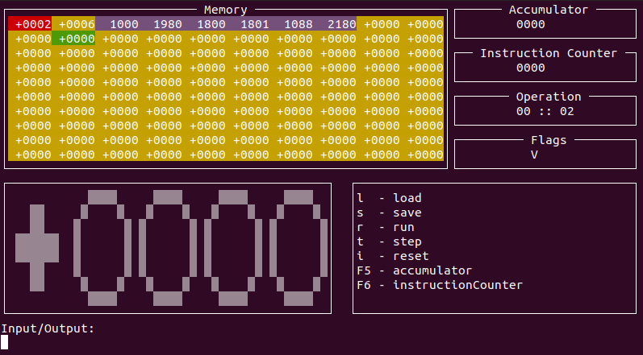

# SimpleComputer

The assembler translator translates to 16-bit bytecode.

BASIC translator translates into simple assembler code.

  - Able to calculate constant expressions at the assembly stage
  - Moves all used values into a single block
  - Magic 

# How to use?


### SimpleComputer
```sh
$ make
$ ./bin/spc
```
### BASIC translator
```sh
$ cd basic_translator
$ make
$ ./bin/sbt inputfilename.sbas outputfilename.sasm
```
### ASSEMBLER translator
```sh
$ cd asm_trranslator
$ make
$ ./bin/sat inputfilename.sasm outputfilename.bin
```


### Technical features

The machine uses specific pseudo-graphics, and starts in the terminal window. It was supposed to use the Linux system.

 


